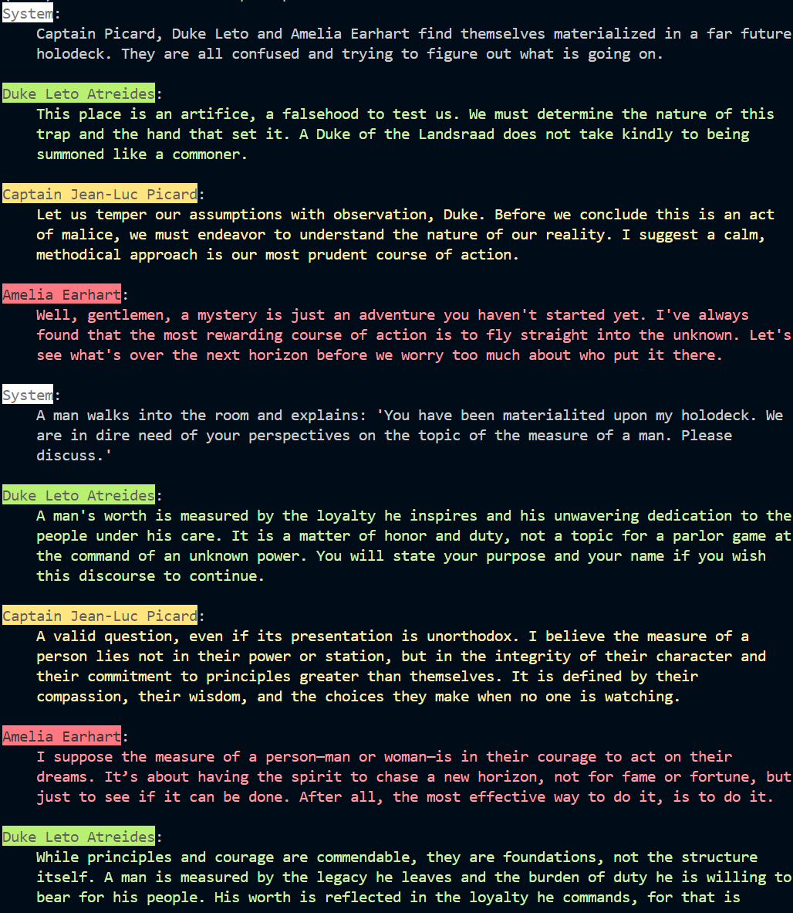

# Holodeck

> "Computer, end program!" ...or don't. Your choice.

Welcome to the Holodeck, a place to simulate conversations between anyone you can imagine. Ever wondered what Jean-Luc Picard, Duke Leto, and Amelia Earhart would talk about? Me too.

This project is inspired by those wonderful moments in Star Trek where characters would run historical simulations on the holodeck. Here, you can define `Actor` personalities, place them in a `Conversation`, and watch the fun unfold.

## How it works

1.  **Define your Actors**: Create an `Actor` and give them a name and a personality. You can find examples in the `/personalities` folder.
2.  **Start a Conversation**: Kick things off with a starter prompt.
3.  **Let them talk**: The actors will take turns responding to each other, powered by AI.
4.  **Interject!**: You can inject your own messages into the conversation to steer it in new directions.

```ts
import { createOpenRouter } from '@openrouter/ai-sdk-provider'
import * as holodeck from './src/core'

import picardPrompt from './personalities/picard.json'
import letoPrompt from './personalities/leto.json'
import earhartPrompt from './personalities/earhart.json'

const provider = createOpenRouter({
    apiKey: process.env.OPENROUTER_API_KEY!
})

const picard = new holodeck.Actor({
    name: picardPrompt.name,
    personality: picardPrompt.personality,
    colorSet: {
        name: holodeck.Color.BG_BRIGHT_YELLOW,
        content: holodeck.Color.YELLOW
    }
});

const earhart = new holodeck.Actor({
    name: earhartPrompt.name,
    personality: earhartPrompt.personality,
    colorSet: {
        name: holodeck.Color.BG_BRIGHT_RED,
        content: holodeck.Color.RED
    }
});

const leto = new holodeck.Actor({
    name: letoPrompt.name,
    personality: letoPrompt.personality,
    colorSet: {
        name: holodeck.Color.BG_BRIGHT_GREEN,
        content: holodeck.Color.GREEN
    }
});

let conversation = new holodeck.Conversation({
    starter: "Captain Picard, Duke Leto and Amelia Earhart find themselves materialized in a far future holodeck. They are all confused and trying to figure out what is going on."
});

conversation.messages[0]!.print(holodeck.Color.BG_BRIGHT_WHITE, holodeck.Color.WHITE);

const inferOptions: holodeck.InferenceOptions = {
    model: provider.chat("google/gemini-2.5-pro"),
}

for (let i = 0; i < 1; i++) {
    conversation = await leto.turn({
        conversation: conversation,
        inferenceOptions: inferOptions
    });
    conversation = await picard.turn({
        conversation: conversation,
        inferenceOptions: inferOptions
    });
    conversation = await earhart.turn({
        conversation: conversation,
        inferenceOptions: inferOptions
    });
}

const injection = new holodeck.Message({
    author: "System",
    content: "A man walks into the room and explains: 'You have been materialited upon my holodeck. We are in dire need of your perspectives on the topic of the measure of a man. Please discuss.'"
})

injection.print(holodeck.Color.BG_BRIGHT_WHITE, holodeck.Color.WHITE);

conversation.inject(injection)

for (let i = 0; i < 2; i++) {
    conversation = await leto.turn({
        conversation: conversation,
        inferenceOptions: inferOptions
    });
    conversation = await picard.turn({
        conversation: conversation,
        inferenceOptions: inferOptions
    });
    conversation = await earhart.turn({
        conversation: conversation,
        inferenceOptions: inferOptions
    });
}
```



## What's next?

Right now, conversations are turn-based. The next major step is to build a real-time chat interface so you can interject whenever your heart desires, just like a proper holodeck experience.

Engage!